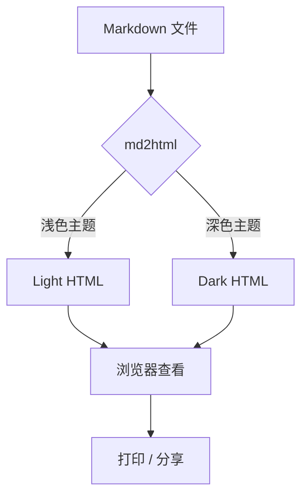
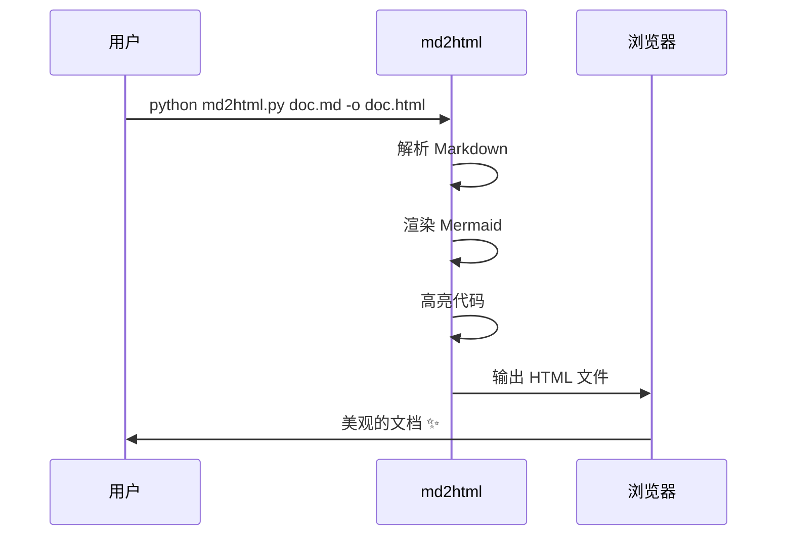
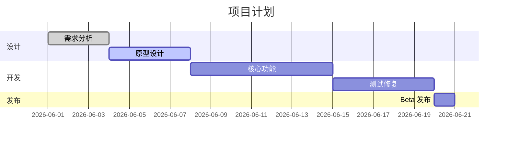
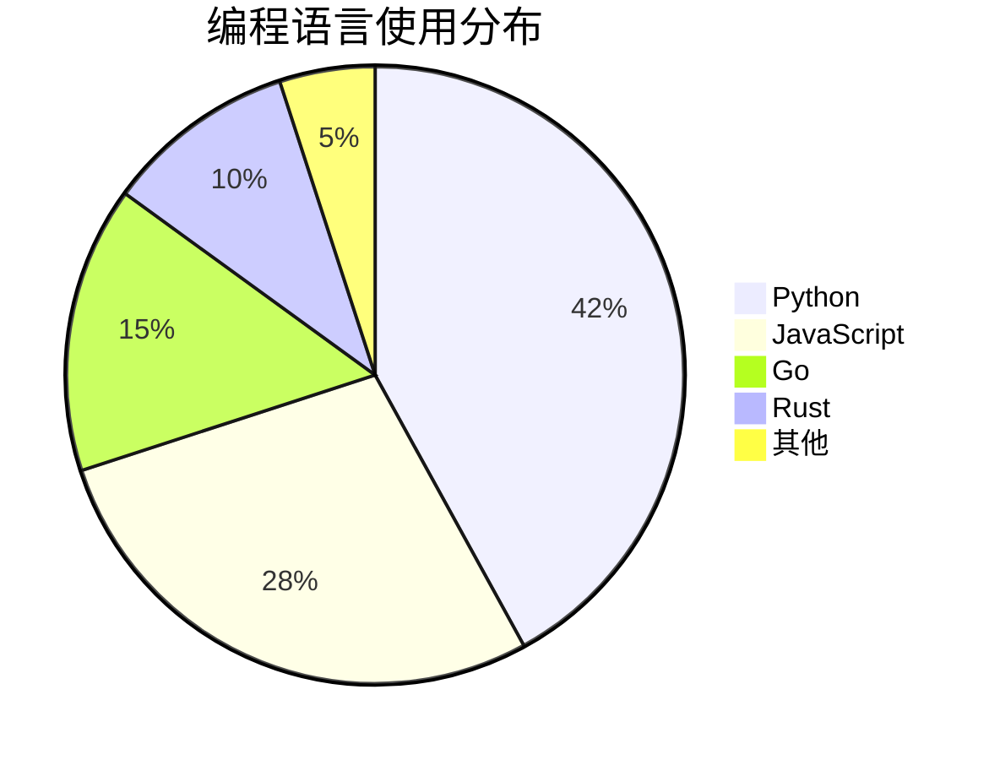

# md2html 功能演示

> **增强版 Markdown → HTML 转换工具** — 支持 Mermaid 图表、代码高亮、数学公式。

---

## 📊 表格支持

| 功能 | 状态 | 说明 |
|------|------|------|
| 标准 Markdown | ✅ | 标题、列表、链接、图片等 |
| Mermaid 图表 | ✅ | 流程图、时序图、甘特图 |
| 代码高亮 | ✅ | Pygments 服务端渲染，450+ 语言 |
| 数学公式 | ✅ | LaTeX 语法，MathJax 渲染 |
| 任务列表 | ✅ | 勾选框支持 |

## ✅ 任务列表

- [x] 完成核心转换逻辑
- [x] 添加 Mermaid 支持
- [x] 添加代码高亮
- [ ] 添加 PDF 导出
- [ ] 添加实时预览

## 📐 数学公式

行内公式：$E = mc^2$

块级公式：

$$
\int_{0}^{\infty} e^{-x^2} dx = \frac{\sqrt{\pi}}{2}
$$

矩阵：

$$
\begin{bmatrix}
a & b \\
c & d
\end{bmatrix}
\begin{bmatrix}
x \\
y
\end{bmatrix}
=
\begin{bmatrix}
ax + by \\
cx + dy
\end{bmatrix}
$$

## 🔷 Mermaid 流程图



## 🔷 Mermaid 时序图



## 🔷 Mermaid 甘特图



## 🔷 Mermaid 饼图



## 💻 代码高亮演示

### Python

```python
import asyncio
from dataclasses import dataclass
from typing import Optional

@dataclass
class Task:
    """一个简单的任务类"""
    name: str
    priority: int = 0
    done: bool = False

    def complete(self) -> None:
        self.done = True

async def process_tasks(tasks: list[Task]) -> list[str]:
    """异步处理任务列表"""
    results = []
    for task in sorted(tasks, key=lambda t: -t.priority):
        await asyncio.sleep(0.1)
        task.complete()
        results.append(f"✅ {task.name}")
    return results
```

### JavaScript

```javascript
// 防抖函数
function debounce(fn, delay = 300) {
  let timer = null;
  return function (...args) {
    clearTimeout(timer);
    timer = setTimeout(() => fn.apply(this, args), delay);
  };
}

// 使用示例
const searchInput = document.querySelector('#search');
searchInput.addEventListener('input', debounce(async (e) => {
  const results = await fetch(`/api/search?q=${e.target.value}`);
  renderResults(await results.json());
}, 500));
```

### SQL

```sql
-- 用户活跃度统计
SELECT
    DATE(created_at) AS date,
    COUNT(DISTINCT user_id) AS active_users,
    COUNT(*) AS total_actions,
    ROUND(COUNT(*) * 1.0 / COUNT(DISTINCT user_id), 2) AS avg_actions_per_user
FROM user_actions
WHERE created_at >= DATE('now', '-30 days')
GROUP BY DATE(created_at)
ORDER BY date DESC;
```

### Shell

```bash
#!/bin/bash
# 批量转换 Markdown 文件
MD2HTML="python md2html.py"

for file in docs/*.md; do
    name=$(basename "$file" .md)
    echo "转换: $file → output/${name}.html"
    $MD2HTML "$file" -o "output/${name}.html" --theme dark
done

echo "✅ 全部完成！"
```

## 📝 引用块

> "优秀的工具应该让复杂的事情变简单，而不是让简单的事情变复杂。"
>
> — 设计哲学

### 多层嵌套引用

> 第一层引用
>> 第二层引用
>>> 第三层引用 — 深层次的思考

## 🎯 提示块（Admonitions）

!!! note "注意"
    这是 `pymdownx.admonition` 扩展支持的提示块，可以自定义标题。

!!! warning "警告"
    确保已安装所有依赖：`pip install markdown pymdown-extensions pygments`

!!! tip "提示"
    使用 `--theme dark` 切换到深色模式，适合夜间阅读。

!!! info "信息"
    Mermaid 图表需要网络连接才能加载 CDN 资源。如需离线使用，可以下载 mermaid.min.js 到本地。

## 📋 定义列表

Markdown
: 一种轻量级标记语言，由 John Gruber 创建

HTML
: 超文本标记语言，用于创建网页的标准语言

CSS
: 层叠样式表，用于描述 HTML 文档的外观

## 🔗 缩写支持

HTML 是 Web 的基础。CSS 负责样式，JS 负责交互。

*[HTML]: HyperText Markup Language
*[CSS]: Cascading Style Sheets
*[JS]: JavaScript

## 📸 图片


---

**Happy Coding! 🎉**
